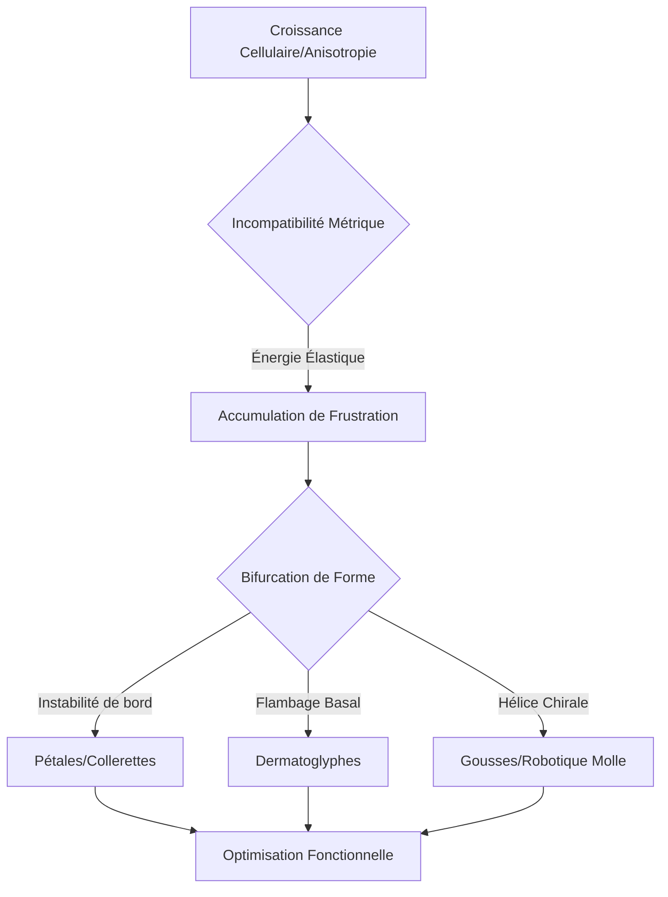

# 🧬 Bio-Geometric-Frustration-Engine


## 🌟 Synopsis
Le **Protocole Ouellette** propose une réinterprétation de la morphogenèse : la forme n'est plus une simple commande génétique, mais un **état d'énergie minimale** né d'une **frustration géométrique**. 

Ce dépôt explore comment l'incompatibilité entre une métrique de croissance locale et l'espace euclidien ambiant force la matière biologique à se courber, se plisser ou bifurquer. Du pétale de lys aux métamatériaux programmables, nous décodons les algorithmes de la nature pour concevoir la robotique molle de demain.

## 📐 Formalisme Mathématique

La dynamique est régie par la compétition entre l'étirement (membrane) et la flexion (bending).

### 1. La Métrique Cible
La croissance est encodée par un tenseur de croissance $\mathbf{G}$ qui transforme la métrique initiale en une métrique de référence $\bar{g}$ :
$$\bar{g} = \mathbf{G}^T \mathbf{G}$$

Si la courbure de Gauss $K$ associée à $\bar{g}$ est non nulle, le système accumule de l'énergie élastique $\mathcal{E}$ :
$$\mathcal{E} = h \int \mathcal{A}^{ijkl} \epsilon_{ij} \epsilon_{kl} dA + \frac{h^3}{12} \int \mathcal{A}^{ijkl} (b_{ij} - \bar{b}_{ij})(b_{kl} - \bar{b}_{kl}) dA$$

### 2. Équations de Föppl-von Kármán (FvK) Modifiées
L'équilibre morphologique est atteint via la résolution de l'équation de compatibilité :
$$\Delta^2 \chi = -Eh [w, w] - Eh K_{target}$$
Où :
* $\chi$ : Fonction d'Airy (contraintes internes).
* $w$ : Déflexion hors-plan.
* $K_{target}$ : Courbure de Gauss imposée par la croissance différentielle.

## 🔄 Architecture du Système



## 📊 Prédictions & Métrologie : Régimes de Forme

| Paramètre (épaisseur ) | Régime Dominant | Morphotype Résultant |
| --- | --- | --- |
|  élevé | Énergie de flexion | Formes développables (cylindres) |
|  faible | Énergie d'étirement | Singularités, rides (d-cones, crêtes) |
|  (Hyperbolique) | Frustration de bord | Selles de cheval, ondulations périodiques |

## 🚀 Applications & Roadmap

* [x] **Phase 1 : Cadre théorique – mise en commun mécanique des plaques / botanique / morphogenèse.
* [ ] **Phase 2 : Simulation** - Solveur éléments finis pour la croissance différentielle.
* [ ] **Phase 3 : Synthèse** - Impression 4D de stents auto-déployables basés sur la métrique inverse.
* [ ] **Phase 4 : Robotique** - Actionneurs bistables "Snap-through" à haute efficacité énergétique.

---

**Auteur :** Bryan Ouellette

```

---
